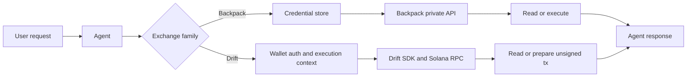

Execution tools are the account-state and action-preparation tools in Rabit.

This family matters because it is where Rabit stops being only descriptive and starts becoming execution-aware.

These tools also power the `execution_snapshot` pipeline node, which gathers execution readiness and account context before the final answer is composed.

## What this family is for

| Product need | How execution tools help |
| --- | --- |
| inspect balances, positions, and open orders | account-read tools query Backpack or Drift state directly |
| understand whether action is currently possible | execution-aware tools expose gates, identity rules, and exchange readiness |
| place or prepare an order | Backpack can execute server-side, while Drift prepares unsigned payloads for client signing |
| ground the final answer in real account state | `execution_snapshot` injects bounded execution context before the answer is formed |

## Why the two exchanges are not the same

| Exchange | Authority model | What the backend can do |
| --- | --- | --- |
| Backpack | API key and secret stored in encrypted exchange connection storage | read private account state and place or cancel orders server-side |
| Drift | authenticated wallet identity plus same-wallet execution preparation | read private account state and prepare unsigned execution payloads for client signing |

Because of that, Rabit cannot treat the two exchanges as one generic trade API.

## All execution tools

| Tool | Useful for | Main value source | Failure shape |
| --- | --- | --- | --- |
| `backpack_get_balances` | inspect available funds | Backpack private API | missing active connection, bad credentials, or API failure |
| `backpack_get_collateral` | inspect margin and collateral | Backpack private API | missing active connection or API failure |
| `backpack_get_open_orders` | inspect working orders | Backpack private API | missing active connection or API failure |
| `backpack_get_order_history` | inspect recent order activity | Backpack private API | missing active connection or API failure |
| `backpack_get_fill_history` | inspect fills | Backpack private API | missing active connection or API failure |
| `backpack_get_positions` | inspect live positions | Backpack private API | missing active connection or API failure |
| `backpack_get_position_history` | inspect previous position changes | Backpack private API | missing active connection or API failure |
| `backpack_place_order` | submit an order server-side | Backpack private API plus execution gate | execution disabled, missing credentials, invalid params, or API rejection |
| `backpack_cancel_order` | cancel an order server-side | Backpack private API plus execution gate | execution disabled, missing order identifier, or API rejection |
| `drift_get_account_context` | inspect request wallet and execution identity | wallet auth plus runtime context | missing auth-derived wallet |
| `drift_get_account_snapshot` | inspect whole Drift account state | Drift SDK plus Solana RPC | missing wallet auth, SDK missing, or RPC failure |
| `drift_get_balances` | inspect Drift balances | Drift SDK plus Solana RPC | missing wallet auth, SDK missing, or RPC failure |
| `drift_get_collateral` | inspect collateral | Drift SDK plus Solana RPC | missing wallet auth, SDK missing, or RPC failure |
| `drift_get_open_orders` | inspect live Drift orders | Drift SDK plus Solana RPC | missing wallet auth, SDK missing, or RPC failure |
| `drift_get_order_history` | inspect recent orders | Drift SDK plus transaction and event parsing | missing wallet auth, SDK missing, or RPC failure |
| `drift_get_fill_history` | inspect recent fills | Drift SDK plus transaction and event parsing | missing wallet auth, SDK missing, or RPC failure |
| `drift_get_position_history` | inspect previous position events | Drift SDK plus transaction and event parsing | missing wallet auth, SDK missing, or RPC failure |
| `drift_get_positions` | inspect current positions | Drift SDK plus Solana RPC | missing wallet auth, SDK missing, or RPC failure |
| `drift_get_open_positions` | inspect open perp positions only | Drift SDK plus Solana RPC | missing wallet auth, SDK missing, or RPC failure |
| `drift_place_order` | prepare a client-signable order | Drift tx builder plus execution request store | execution disabled, wallet mismatch, or tx-builder failure |
| `drift_cancel_order` | prepare a client-signable cancel | Drift tx builder plus execution request store | execution disabled, missing order id, or tx-builder failure |

## How this family works

## Per-tool breakdown

| Tool | Useful for | How it works | Main output |
| --- | --- | --- | --- |
| `backpack_get_balances` | inspect available funds | reads balances through the active Backpack connection | balance snapshot |
| `backpack_get_collateral` | inspect margin and collateral | reads collateral state from Backpack private endpoints | collateral snapshot |
| `backpack_get_open_orders` | inspect working orders | queries Backpack open orders for the active account | open-order list |
| `backpack_get_order_history` | inspect recent order activity | reads Backpack order history endpoints | order-history list |
| `backpack_get_fill_history` | inspect fills | reads Backpack fill history endpoints | fill-history list |
| `backpack_get_positions` | inspect live positions | queries Backpack positions for the active account | position snapshot |
| `backpack_get_position_history` | inspect previous position changes | reads Backpack position-history endpoints | position-history list |
| `backpack_place_order` | submit an order server-side | validates execution gate and credentials, then calls Backpack order placement | order placement result |
| `backpack_cancel_order` | cancel an order server-side | validates execution gate and order identity, then calls Backpack cancel | cancel result |
| `drift_get_account_context` | understand request wallet and execution identity | reads wallet-derived runtime context from the authenticated request | request wallet and execution metadata |
| `drift_get_account_snapshot` | inspect whole Drift account state | reads the user account through Drift SDK and Solana RPC | full account snapshot |
| `drift_get_balances` | inspect Drift balances | reads balance-related account state through Drift SDK | balance snapshot |
| `drift_get_collateral` | inspect collateral | computes or reads collateral-oriented account state through Drift SDK | collateral snapshot |
| `drift_get_open_orders` | inspect live Drift orders | reads open orders from the Drift account | open-order list |
| `drift_get_order_history` | inspect recent orders | parses recent order-related records from Drift history surfaces | order-history list |
| `drift_get_fill_history` | inspect recent fills | parses fill-related records from Drift history surfaces | fill-history list |
| `drift_get_position_history` | inspect previous position events | parses position-affecting history from Drift records | position-history list |
| `drift_get_positions` | inspect current positions | reads all current Drift positions | position snapshot |
| `drift_get_open_positions` | inspect live perp positions only | filters the current positions down to open ones | open-position list |
| `drift_place_order` | prepare a client-signable order | validates gate and same-wallet rules, then builds an unsigned transaction payload | unsigned order request payload |
| `drift_cancel_order` | prepare a client-signable cancel | validates gate and identifiers, then builds an unsigned cancel payload | unsigned cancel request payload |

## Error handling inside the execution family

| Layer | Backpack behavior | Drift behavior |
| --- | --- | --- |
| identity and ownership | user-scoped credential lookup can fail if no active connection exists | wallet-derived identity check fails if the user is not authenticated with a wallet |
| execution gate | backend and request gate can block live execution | backend gate plus same-wallet verification can block live execution |
| provider layer | Backpack API may reject credentials or request parameters | Drift SDK or Solana RPC may fail, rate-limit, or lack dependencies |
| tool result | raised exceptions are normalized by the tool registry into error details the agent can interpret | same normalized registry behavior |

## What the agent does when execution tools fail

| Failure type | Typical agent response |
| --- | --- |
| missing Backpack connection | explain that a connection must be created before private reads or execution |
| Backpack execution disabled | explain that execution is gated even if read-only access exists |
| missing Drift wallet auth | explain that Drift tools require wallet-authenticated identity |
| Drift same-wallet requirement not met | explain that v1 execution only supports verified same-wallet mode |
| provider outage or RPC issue | continue with available context and avoid pretending an order was prepared or placed |

## Why this family matters

Execution tools are what make Rabit more than an analysis assistant.

They are the bridge from:

- "tell me what I have"
- to "tell me what I can do"
- and, where allowed, to "prepare or execute the next action"

## Related docs

| If you want... | Read |
| --- | --- |
| Backpack credential model | [Backpack API Key Flow and Storage](../integrations/backpack/api-key-flow-and-storage) |
| Drift wallet and execution identity | [Drift Auth and Execution Wallet](../integrations/drift/auth-and-execution-wallet) |
| Drift signer tradeoffs | [Drift Signer Architecture](../integrations/drift/signer-architecture) |
| endpoint-level contract for these flows | [API Reference: Exchange Connections](/api-reference/exchange-connections) and [API Reference: Drift](/api-reference/drift) |
