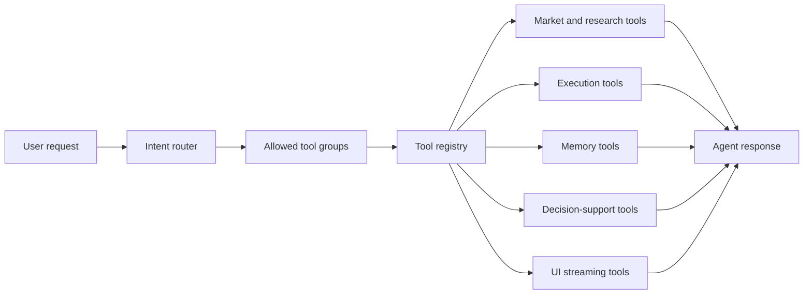

Tools are what make Rabit behave like an agentic product instead of a text-only assistant.

They are the layer that lets the model:

- read current market state instead of guessing
- work with exchange accounts instead of describing imaginary actions
- produce deterministic calculations instead of approximate prose
- persist user memory and post-trade reviews across sessions
- emit structured UI events that the mobile client can render cleanly

## Why this layer matters

| Tooling outcome | What changes for the user |
| --- | --- |
| grounded market answers | price, balances, positions, and market context come from live or persisted system state |
| execution-aware guidance | Rabit can tell the user what is actually possible on Backpack or Drift right now |
| deterministic decision support | sizing, scanning, and trade review become more repeatable than free-form reasoning |
| persistent assistant behavior | memory and debrief tools let the product accumulate useful user context |
| structured frontend experience | the agent can stream plans, hints, and progress in a UI-safe format |

## How the tool layer fits into Rabit

## Tool families in Rabit

| Tool family | Product role | Main value source |
| --- | --- | --- |
| Market | live prices, news, search, monitoring, and alert workflows | WebSocket market state, DuckDuckGo web/news search, price monitor runtime |
| TradingView | chart-aware workflows beyond simple price lookup | TradingView mobile/web bridge running through the local chart API |
| Execution | account reads and order workflows for Backpack and Drift | Backpack private API, Drift SDK/RPC, exchange connection store, execution request store |
| Decision support | deterministic outputs for sizing, scanning, and structured review | formula logic, tracked asset universe, trade debrief database |
| Memory | long-term user memory and structured trade review persistence | Mem0 memory store and trade debrief store |
| UI streaming | structured intermediate UI events during agent execution | runtime event emitter inside the agent streaming flow |

## Agent-side error model

Rabit handles tool errors in two layers.

| Layer | What happens |
| --- | --- |
| tool implementation | each tool either returns structured failure data or raises a focused error such as invalid parameters, missing credentials, or unavailable infrastructure |
| tool registry | the registry validates required parameters, rejects unknown parameters, catches runtime exceptions, and returns normalized error details back to the agent |

That means a failed tool does not have to crash the whole user turn. In most cases the agent can either:

- explain that the requested action is not currently available
- suggest the next valid step
- fall back to analysis using the remaining context

## Read this next

| Section | What it adds |
| --- | --- |
| [Tools Overview](./overview) | full coverage table of all currently registered tool surfaces |
| [Market](./market) | where price, news, monitoring, and research value comes from |
| [TradingView](./tradingview) | how chart control and chart reads work |
| [Execution](./execution) | how Backpack and Drift tools differ in authority and failure modes |
| [Decision Support](./decision-support) | deterministic outputs for sizing, scanning, and debriefs |
| [Memory](./memory) | what Rabit remembers and how durable storage is used |
| [UI Streaming](./ui-streaming) | how the agent emits structured frontend events |
| [Monitoring](/monitoring) | the dedicated background monitoring layer for price alerts and live news |
