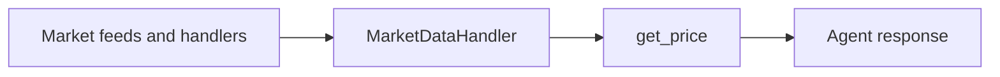

`get_price` is the fastest market-read tool in Rabit.

It is the tool the agent uses when the user needs current market state without starting a larger research or chart workflow.

## What it returns

| Field | Meaning |
| --- | --- |
| `price` | current price |
| `change_24h` | 24-hour percentage move |
| `volume_24h` | 24-hour volume when available |
| `high_24h` / `low_24h` | current daily range |
| `market_cap` / `fdv` | asset-level market sizing metrics when available |
| `open_interest` / `funding_rate` | derivatives context when available |
| `timestamp` | freshness marker for the returned snapshot |

## Where the value comes from

The tool does not scrape a website or guess the answer. It reads the current symbol snapshot from the backend market-data layer.

## Error handling

| Failure type | Tool behavior | Agent implication |
| --- | --- | --- |
| symbol is not tracked or unavailable | returns `success: false` with a clear suggestion | the agent should explain that live price data is unavailable for that symbol |
| market data layer has no fresh value | returns a structured failure payload | the agent can fall back to broader analysis, but should not claim a live price |

## When the agent should use it

| Good fit | Better tool family |
| --- | --- |
| "what is SOL right now" | `get_price` |
| "what should I monitor for BTC" | market monitoring tools |
| "show BTC on 4H with RSI" | TradingView tools |

## Related docs

| If you want... | Read |
| --- | --- |
| the full market family | [Market Tools](./index) |
| monitoring and alerts | [Price Monitor](./price-monitor) |
| the live data architecture | [WebSocket Overview](../../websocket/overview) |
