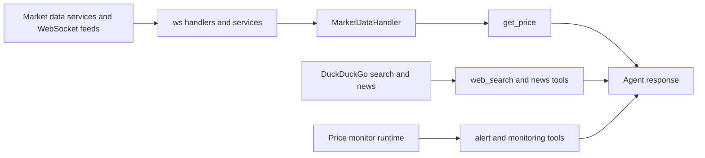

Market tools are the lightweight information tools that let Rabit observe the market before it moves into execution.

They answer the first layer of user need:

- what is the price now
- what changed
- what news matters
- what should I keep watching

They also power the `market_snapshot` pipeline node, which injects a compact read-only asset snapshot into the final runtime prompt before the user sees the answer.

They now also power `research_snapshot` when the request needs a broader news-and-search enrichment pass without escalating into a fully open-ended research loop.

## What is in this family

| Tool | Purpose | Value source |
| --- | --- | --- |
| `get_price` | reads current market price and core metrics | `MarketDataHandler` backed by the live market-data layer |
| `web_search` | gets external web context | DuckDuckGo search via `ddgs` |
| `get_latest_news` | gets latest news by category | DuckDuckGo news |
| `search_news_by_keywords` | searches news with keyword and regex support | DuckDuckGo news + regex filter |
| `get_trending_news` | gets recent trending crypto news | DuckDuckGo news + short cache |
| `search_news_by_symbols` | groups news by symbol | per-symbol news queries |
| `start_news_monitoring` | starts background news monitoring | news monitoring runtime |
| `stop_news_monitoring` | stops background news monitoring | news monitoring runtime |
| `get_monitoring_status` | returns monitoring status and stats | news monitoring runtime |
| `add_price_alert` | stores validation/invalidation alert | price monitor runtime |
| `remove_price_alert` | removes alert | price monitor runtime |
| `list_price_alerts` | lists active and triggered alerts | price monitor runtime |
| `get_price_alert` | reads one alert | price monitor runtime |
| `get_price_monitor_stats` | gets monitor stats | price monitor runtime |
| `start_price_monitor` | starts price poller | price monitor runtime |
| `stop_price_monitor` | stops price poller | price monitor runtime |

## How this family powers `market_snapshot`

| Node input | Tool used | Why it matters |
| --- | --- | --- |
| active symbol | `get_price` | gives the runtime a live price anchor instead of vague market language |
| active symbol | `search_news_by_symbols` | gives the runtime a small, asset-specific headline tail |

This means the final answer can combine:

- technical chart evidence from `chart_analysis`
- live price context from `get_price`
- recent asset headlines from `search_news_by_symbols`

without pretending that every market question needs a full research pass first.

## Public product surfaces built on this family

| Surface | What it gives the client |
| --- | --- |
| `GET /api/news/assets/{symbol}` | compact asset-specific news snapshot |
| `WS /api/ws/news` | live news snapshot plus incremental updates |
| `market_context.news_context.tail_titles` | short headline tail that can be fed back into the agent turn |

That means the same retrieval family supports:

- frontend news cards
- live symbol news feeds
- agent-side news context

## How value enters the system

## What the agent gets from this family

| Category | What the agent can do with it |
| --- | --- |
| live price context | answer direct price questions and compare tracked assets |
| research context | add fresh public information when market context alone is not enough |
| monitoring state | tell the user what is currently being tracked or monitored |
| alert state | reflect whether a setup is still valid or already invalidated |

## Error handling inside the tools

| Tool pattern | How errors are handled |
| --- | --- |
| `get_price` | returns `success: false` with a helpful suggestion when the symbol has no live data |
| web/news search | returns disabled or no-results payloads instead of crashing the turn |
| price alert operations | validate symbol, direction, exchange, and numeric prices before mutating monitor state |
| monitor start/stop/stats | catch exceptions and return structured `success: false` responses |

## What the agent does when market tools fail

| Failure type | Typical agent behavior |
| --- | --- |
| symbol not tracked | explain that current live data is unavailable and guide the user toward supported assets |
| search/news unavailable | continue with existing market context instead of pretending to have fresh external research |
| monitor not running | explain that alerting state exists but background monitoring must be started |
| invalid alert parameters | ask for corrected symbol, direction, or price levels |

## Why this family matters

Market tools give Rabit a grounded first response before execution is even relevant.

That is especially important on mobile, where the user often wants a fast answer to:

- what is happening right now
- should I pay attention to this move
- has my setup validated or broken

## Related docs

| If you want... | Read |
| --- | --- |
| direct chart control instead of generic market reads | [TradingView Tools](../tradingview) |
| exchange account state and execution | [Execution Tools](../execution) |
| the underlying live data architecture | [Real-Time Market Data](../../features/market-data) |
| legacy detail pages for this family | [Get Price Tool](./get-price-tool) and [Price Monitor](./price-monitor) |
