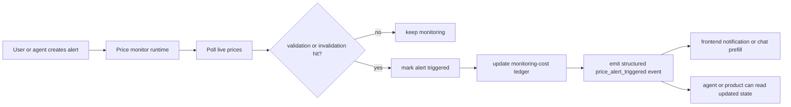

The price monitor is the alert-oriented part of the market tool layer.

It is designed for workflows like:

- "tell me when the setup validates"
- "tell me if my invalidation breaks"
- "show me which setups are still active"

## Tool surface

| Tool | What it does |
| --- | --- |
| `add_price_alert` | stores a validation/invalidation alert |
| `remove_price_alert` | removes one alert |
| `list_price_alerts` | lists active and triggered alerts |
| `get_price_alert` | reads one alert |
| `get_price_monitor_stats` | returns monitor status and counts |
| `start_price_monitor` | starts background polling |
| `stop_price_monitor` | stops background polling |

## Monitoring cost

Price alerts now add backend service cost separately from model cost.

| Cost field | Meaning |
| --- | --- |
| `alert_setup_cost_usd` | charged when the alert is created |
| `monitoring_cost_usd` | charged while the symbol stays actively monitored |
| `trigger_cost_usd` | charged when the alert actually triggers |
| `total_cost_usd` | combined monitoring cost for the scope |

## How it works

## Trigger payload and default prompt

When an alert triggers, Rabit now emits a structured `price_alert_triggered` event instead of only a loose text notification.

| Field | Meaning |
| --- | --- |
| `alert_id` | internal alert reference |
| `symbol` | tracked asset |
| `exchange` | exchange monitor source |
| `trigger_type` | `VALIDATION` or `INVALIDATION` |
| `trigger_price` | actual price that crossed the level |
| `trigger_time` | when Rabit detected the hit |
| `trade_label` / `trade_id` / `setup_id` | optional user-facing or app-facing references |
| `default_prompt` | ready-to-use prompt text for the client |

Example `default_prompt`:

- `Trade A hit validation price at $95,000.00 on DRIFT for BTC.`
- `SOL breakdown setup hit invalidation price at $142.50 on BACKPACK for SOL.`

That means the frontend can:

- show a notification
- prefill the chat box
- trigger a follow-up agent run later without inventing its own wording

## Add-alert metadata

`add_price_alert` now accepts optional metadata:

| Field | Why it matters |
| --- | --- |
| `trade_label` | human-friendly text like `Trade A` or `SOL breakout setup` |
| `trade_id` | stable trade reference for app logic |
| `setup_id` | stable setup reference for app logic |

The tool also returns preview prompts for both trigger directions, so the client can see what automation text will look like before the price moves.

## Error handling

| Failure type | Tool behavior | Agent implication |
| --- | --- | --- |
| invalid symbol, direction, or exchange | validation failure is returned immediately | the agent should ask for corrected inputs |
| non-numeric price levels | returns structured validation error | the agent should not try to infer prices from text |
| alert ID not found | remove/get operations return a not-found failure | the agent should inspect `list_price_alerts` first |
| monitor runtime start/stop failure | returns structured runtime error | the agent should explain that background monitoring is not active |
| trigger event delivery failure | monitor still marks the alert as triggered and logs callback/broadcast failure | the client can still recover state from `list_price_alerts` or `get_price_alert` |

## Why this matters in Rabit

The monitor lets Rabit keep track of "what should happen next" instead of only answering "what is happening now".

That makes it useful for mobile workflows where the user wants ongoing awareness, not only one-off analysis.

## Related docs

| If you want... | Read |
| --- | --- |
| the broader market family | [Market Tools](./index) |
| current exchange-aware actions | [Exchange Execution](../../features/execution) |
