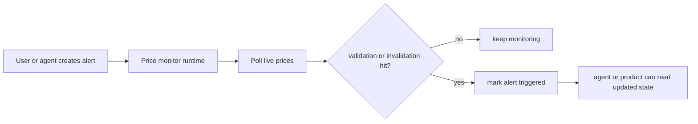

The price monitor is the alert-oriented part of the market tool layer.

It is designed for workflows like:

- "tell me when the setup validates"
- "tell me if my invalidation breaks"
- "show me which setups are still active"

## Tool surface

| Tool | What it does |
| --- | --- |
| `add_price_alert` | stores a validation/invalidation alert |
| `remove_price_alert` | removes one alert |
| `list_price_alerts` | lists active and triggered alerts |
| `get_price_alert` | reads one alert |
| `get_price_monitor_stats` | returns monitor status and counts |
| `start_price_monitor` | starts background polling |
| `stop_price_monitor` | stops background polling |

## How it works

## Error handling

| Failure type | Tool behavior | Agent implication |
| --- | --- | --- |
| invalid symbol, direction, or exchange | validation failure is returned immediately | the agent should ask for corrected inputs |
| non-numeric price levels | returns structured validation error | the agent should not try to infer prices from text |
| alert ID not found | remove/get operations return a not-found failure | the agent should inspect `list_price_alerts` first |
| monitor runtime start/stop failure | returns structured runtime error | the agent should explain that background monitoring is not active |

## Why this matters in Rabit

The monitor lets Rabit keep track of "what should happen next" instead of only answering "what is happening now".

That makes it useful for mobile workflows where the user wants ongoing awareness, not only one-off analysis.

## Related docs

| If you want... | Read |
| --- | --- |
| the broader market family | [Market Tools](./index) |
| current exchange-aware actions | [Exchange Execution](../../features/execution) |
