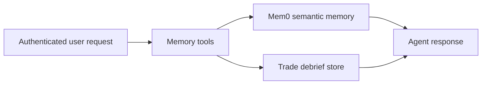

Memory tools let Rabit work across more than one turn or one session.

They are the reason the backend can behave like a returning assistant instead of a stateless chat API.

## Full coverage

| Tool | What it does | Value source | Failure model |
| --- | --- | --- | --- |
| `add_user_memory` | stores durable long-term memory | Mem0 client + active `user_id` | raises if memory tools are disabled, no user is active, or metadata is invalid |
| `get_user_memory` | lists or searches user memory | Mem0 client + active `user_id` | raises if memory tools are disabled or no user is active |
| `delete_user_memory` | deletes a specific memory | Mem0 client + active `user_id` | raises if memory tools are disabled or no user is active |
| `clear_user_memories` | wipes all memories for a user | Mem0 client + active `user_id` | raises if memory tools are disabled or no user is active |
| `create_trade_debrief` | stores structured trade review | trade debrief service + active `user_id` | raises if no user is active or persistence fails |

## Two kinds of memory in Rabit

| Type | What it stores | Why it exists |
| --- | --- | --- |
| long-term semantic memory | preferences, stable facts, user-specific context | helps the assistant stay personalized over time |
| structured trade debriefs | trade recap, lesson, tags, optional prices and PnL | supports journaling and repeated post-trade review |

## How the memory family works

## Error handling and agent behavior

| Failure type | How it is handled | What the agent should do |
| --- | --- | --- |
| memory tools disabled by config | tool raises explicit configuration error | explain that long-term memory is unavailable in this environment |
| request has no active `user_id` | tool raises identity error | avoid pretending anything was stored and ask the user to authenticate |
| invalid metadata JSON | tool raises parse/validation error | ask for corrected structured input |
| debrief persistence failure | tool raises runtime error | explain that the review could not be saved, even if the chat discussion succeeded |

## Why this family matters

Memory tools let Rabit preserve the difference between:

- “this user mentioned something once”
- and “this should keep shaping the assistant later”

They also prevent trade review from disappearing into chat history.

## Related docs

| If you want... | Read |
| --- | --- |
| storage details | [Data Layer](../architecture/data-layer) |
| provider details | [Mem0 Integration](../integrations/mem0/integration) |
| broader product role of memory | [Memory and Context](../features/memory) |
