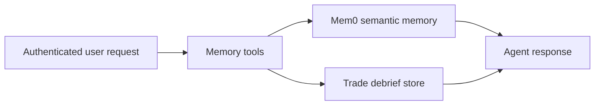

Memory tools let Rabit work across more than one turn or one session.

They are the reason the backend can behave like a returning assistant instead of a stateless chat API.

They also power the `memory_snapshot` pipeline node, which recalls relevant stored user context before the final answer is formed.

## What this family is for

| Product need | How memory tools help |
| --- | --- |
| remember stable user preferences | semantic memory stores durable context beyond one chat turn |
| recall relevant context before answering | `memory_snapshot` can fetch stored context before the final response |
| keep structured post-trade lessons | debrief storage preserves reviews outside chat history |
| let users manage what the assistant remembers | memory CRUD tools expose add, read, delete, and clear flows |

## All memory tools

| Tool | Useful for | Value source | Failure shape |
| --- | --- | --- | --- |
| `add_user_memory` | store durable long-term memory | Mem0 client plus active `user_id` | memory disabled, missing user, or invalid metadata |
| `get_user_memory` | list or search user memory | Mem0 client plus active `user_id` | memory disabled or missing user |
| `delete_user_memory` | delete a specific memory | Mem0 client plus active `user_id` | memory disabled or missing user |
| `clear_user_memories` | wipe all user memories | Mem0 client plus active `user_id` | memory disabled or missing user |
| `create_trade_debrief` | store structured trade review | trade debrief service plus active `user_id` | missing user or persistence failure |

## Two kinds of memory in Rabit

| Type | What it stores | Why it exists |
| --- | --- | --- |
| long-term semantic memory | preferences, stable facts, user-specific context | helps the assistant stay personalized over time |
| structured trade debriefs | trade recap, lesson, tags, optional prices and PnL | supports journaling and repeated post-trade review |

## How this family works

## Per-tool breakdown

| Tool | Useful for | How it works | Main output |
| --- | --- | --- | --- |
| `add_user_memory` | save durable user context | validates active user identity and writes a semantic memory record | persisted memory confirmation |
| `get_user_memory` | recall or search existing memory | queries the user's stored memory, optionally with a semantic search query | memory list or search results |
| `delete_user_memory` | remove one memory entry | deletes one memory by id for the active user | deletion confirmation |
| `clear_user_memories` | wipe all stored memory | deletes all memory entries for the active user | bulk-clear confirmation |
| `create_trade_debrief` | save a structured trade review | validates active user identity and writes a normalized debrief record | persisted debrief record |

## Error handling and agent behavior

| Failure type | How it is handled | What the agent should do |
| --- | --- | --- |
| memory tools disabled by config | tool raises explicit configuration error | explain that long-term memory is unavailable in this environment |
| request has no active `user_id` | tool raises identity error | avoid pretending anything was stored and ask the user to authenticate |
| invalid metadata JSON | tool raises parse or validation error | ask for corrected structured input |
| debrief persistence failure | tool raises runtime error | explain that the review could not be saved, even if the chat discussion succeeded |

## Why this family matters

Memory tools let Rabit preserve the difference between:

- "this user mentioned something once"
- and "this should keep shaping the assistant later"

They also prevent trade review from disappearing into chat history.

## Related docs

| If you want... | Read |
| --- | --- |
| storage details | [Data Layer](../architecture/data-layer) |
| provider details | [Mem0 Integration](../integrations/mem0/integration) |
| broader product role of memory | [Memory and Context](../features/memory) |
