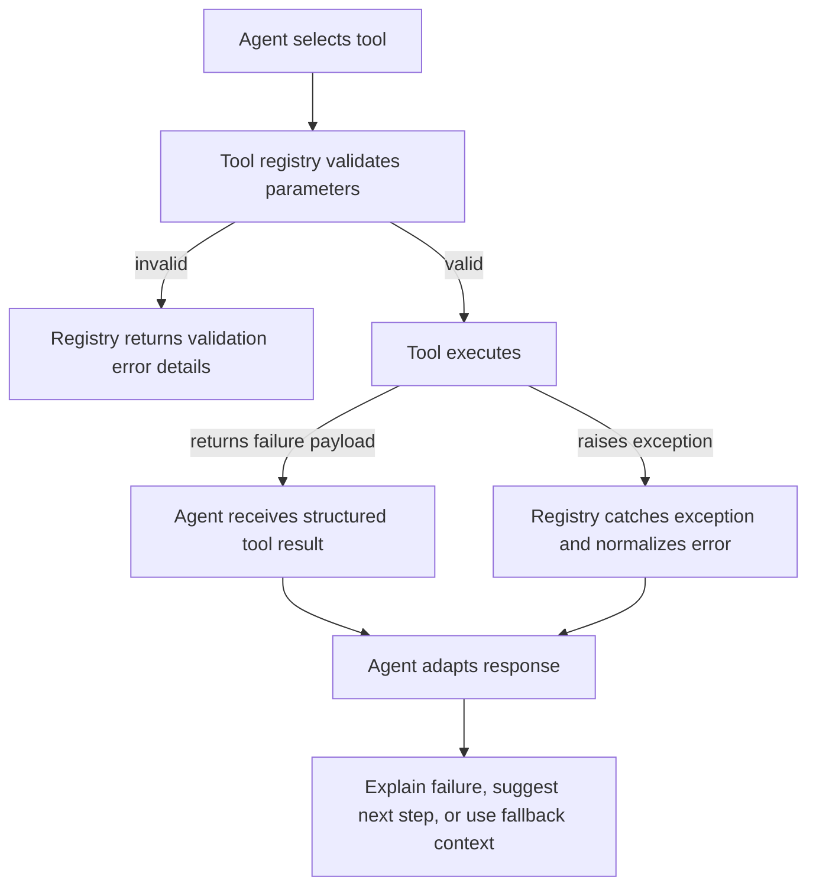

This page is the full tool-surface map for the current Rabit backend.

It answers four questions:

1. what tools exist right now
2. which family they belong to
3. where their value comes from
4. how failure is handled before the agent responds

## Full coverage map

| Family | Tool | What it does | Main value source | Failure shape |
| --- | --- | --- | --- | --- |
| Market | `get_price` | returns current price and core market metrics for a tracked symbol | `MarketDataHandler` backed by real-time market data services | structured `success: false` response when symbol data is missing |
| Market | `web_search` | performs web search for broader market or research context | DuckDuckGo search via `ddgs` | structured disabled/no-results response |
| Market | `get_latest_news` | returns latest news by category | DuckDuckGo news | empty or fallback response on fetch errors |
| Market | `search_news_by_keywords` | searches news with keyword and regex support | DuckDuckGo news + regex filtering | empty results on fetch/filter failure |
| Market | `get_trending_news` | returns cached trending crypto news | DuckDuckGo news + short in-process cache | empty results on provider failure |
| Market | `search_news_by_symbols` | groups news by symbol set | DuckDuckGo news per symbol query | partial or empty grouped result |
| Market | `start_news_monitoring` | starts background news monitoring | news monitoring runtime | structured failure if monitor cannot start |
| Market | `stop_news_monitoring` | stops background news monitoring | news monitoring runtime | structured failure if stop fails |
| Market | `get_monitoring_status` | returns monitor status and sentiment stats | news monitoring runtime state | structured failure |
| Market | `add_price_alert` | stores validation/invalidation alert | price monitor runtime | structured validation error or runtime error |
| Market | `remove_price_alert` | removes one alert | price monitor runtime | structured not-found error |
| Market | `list_price_alerts` | lists alerts and trigger status | price monitor runtime | structured runtime error |
| Market | `get_price_alert` | reads a single alert | price monitor runtime | structured not-found error |
| Market | `get_price_monitor_stats` | returns monitor stats | price monitor runtime | structured runtime error |
| Market | `start_price_monitor` | starts price polling | price monitor runtime | structured runtime error |
| Market | `stop_price_monitor` | stops price polling | price monitor runtime | structured runtime error |
| TradingView | `tv_get_state` | reads current chart state | TradingView bridge API | normalized chart/API connectivity error |
| TradingView | `tv_set_symbol` | changes chart symbol | TradingView bridge API | normalized invalid-symbol or connectivity error |
| TradingView | `tv_set_timeframe` | changes timeframe | TradingView bridge API | normalized invalid-timeframe or connectivity error |
| TradingView | `tv_set_chart_type` | changes chart style | TradingView bridge API | normalized invalid-type or connectivity error |
| TradingView | `tv_scroll_to_date` | scrolls to historical date | TradingView bridge API | normalized invalid-date or connectivity error |
| TradingView | `tv_get_quote` | reads chart-linked quote | TradingView bridge API | normalized read failure |
| TradingView | `tv_get_ohlcv` | reads OHLCV or summary stats | TradingView bridge API | normalized read failure |
| TradingView | `tv_get_indicator_values` | reads visible indicator values | TradingView bridge API | normalized read failure |
| TradingView | `tv_add_indicator` | adds indicator to chart | TradingView bridge API | normalized invalid-input or bridge error |
| TradingView | `tv_remove_indicator` | removes indicator by entity id | TradingView bridge API | normalized not-found or bridge error |
| TradingView | `tv_set_indicator_inputs` | updates indicator settings | TradingView bridge API | normalized invalid-input or bridge error |
| TradingView | `tv_draw_line` | draws a line on the chart | TradingView bridge API | normalized validation or bridge error |
| TradingView | `tv_draw_horizontal_line` | draws a horizontal level | TradingView bridge API | normalized validation or bridge error |
| TradingView | `tv_clear_drawings` | clears drawings | TradingView bridge API | normalized bridge error |
| TradingView | `tv_create_alert` | creates chart alert | TradingView bridge API | normalized validation or bridge error |
| TradingView | `tv_list_alerts` | lists chart alerts | TradingView bridge API | normalized bridge error |
| TradingView | `tv_delete_alert` | deletes chart alert | TradingView bridge API | normalized not-found or bridge error |
| TradingView | `tv_capture_screenshot` | captures chart image | TradingView bridge API | normalized bridge error |
| Execution | `backpack_get_balances` | reads balances | Backpack private API + credential store | raises missing-credential or API failure |
| Execution | `backpack_get_collateral` | reads collateral | Backpack private API + credential store | raises missing-credential or API failure |
| Execution | `backpack_get_open_orders` | reads open orders | Backpack private API + credential store | raises missing-credential or API failure |
| Execution | `backpack_get_order_history` | reads order history | Backpack private API + credential store | raises missing-credential or API failure |
| Execution | `backpack_get_fill_history` | reads fill history | Backpack private API + credential store | raises missing-credential or API failure |
| Execution | `backpack_get_positions` | reads positions | Backpack private API + credential store | raises missing-credential or API failure |
| Execution | `backpack_get_position_history` | reads position history | Backpack private API + credential store | raises missing-credential or API failure |
| Execution | `backpack_place_order` | places live order | Backpack private API + execution gate | raises gate failure, missing credential, or API error |
| Execution | `backpack_cancel_order` | cancels live order | Backpack private API + execution gate | raises gate failure, missing identifier, or API error |
| Execution | `drift_get_account_context` | returns request wallet + execution context | wallet auth + runtime context | raises only when upstream context is broken |
| Execution | `drift_get_account_snapshot` | returns subaccount snapshot | Drift SDK + Solana RPC | raises missing-wallet or SDK/RPC error |
| Execution | `drift_get_balances` | reads spot balances | Drift SDK + Solana RPC | raises missing-wallet or SDK/RPC error |
| Execution | `drift_get_collateral` | reads collateral | Drift SDK + Solana RPC | raises missing-wallet or SDK/RPC error |
| Execution | `drift_get_open_orders` | reads open orders | Drift SDK + Solana RPC | raises missing-wallet or SDK/RPC error |
| Execution | `drift_get_order_history` | parses recent order history | Drift SDK + transaction/event parsing | raises missing-wallet or SDK/RPC error |
| Execution | `drift_get_fill_history` | parses recent fills | Drift SDK + transaction/event parsing | raises missing-wallet or SDK/RPC error |
| Execution | `drift_get_position_history` | parses recent position-affecting events | Drift SDK + transaction/event parsing | raises missing-wallet or SDK/RPC error |
| Execution | `drift_get_positions` | reads current positions | Drift SDK + Solana RPC | raises missing-wallet or SDK/RPC error |
| Execution | `drift_get_open_positions` | reads open perp positions | Drift SDK + Solana RPC | raises missing-wallet or SDK/RPC error |
| Execution | `drift_place_order` | prepares unsigned order payload | Drift tx builder + execution request store | raises gate failure, wallet mismatch, or tx-builder error |
| Execution | `drift_cancel_order` | prepares unsigned cancel payload | Drift tx builder + execution request store | raises gate failure, missing ID, or tx-builder error |
| Decision support | `calculate_position_size` | computes deterministic size | formula logic only | raises parameter validation error |
| Decision support | `scan_markets` | ranks tracked asset universe | tracked assets + live market service + current market context | skips failing assets and raises only on invalid arguments |
| Decision support | `create_trade_debrief` | persists structured debrief | trade debrief store + user identity | raises missing-user or persistence error |
| Memory | `add_user_memory` | saves long-term memory | Mem0 client + user identity | raises memory-disabled, missing-user, or metadata parse error |
| Memory | `get_user_memory` | lists or searches memories | Mem0 client + user identity | raises memory-disabled or missing-user error |
| Memory | `delete_user_memory` | deletes one memory | Mem0 client + user identity | raises memory-disabled or missing-user error |
| Memory | `clear_user_memories` | wipes all memories for a user | Mem0 client + user identity | raises memory-disabled or missing-user error |
| Memory | `create_trade_debrief` | stores structured trade review | trade debrief service + user identity | raises missing-user or persistence error |
| UI streaming | `show_thinking_summary` | emits concise progress update | runtime event emitter | raises validation error or returns `streamed: false` when no emitter exists |
| UI streaming | `show_plan` | emits structured plan | runtime event emitter | raises JSON or schema validation error |
| UI streaming | `show_hint` | emits HITL branch selection prompt | runtime event emitter | raises JSON or schema validation error |

## How Rabit handles tool failure

## Practical reading guide

| If you want to understand... | Read |
| --- | --- |
| where Rabit gets market, news, and monitoring value | [Market Tools](./market) |
| how chart-aware workflows differ from generic market tools | [TradingView Tools](./tradingview) |
| how Backpack and Drift tool behavior diverges | [Execution Tools](./execution) |
| which outputs are deterministic instead of conversational | [Decision Support Tools](./decision-support) |
| how durable context and journaling work | [Memory Tools](./memory) |
| how streaming UI events are shaped for the client | [UI Streaming Tools](./ui-streaming) |
