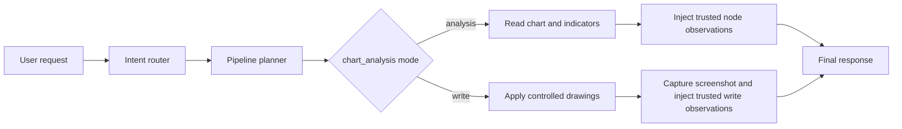
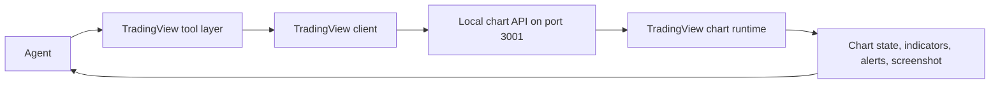
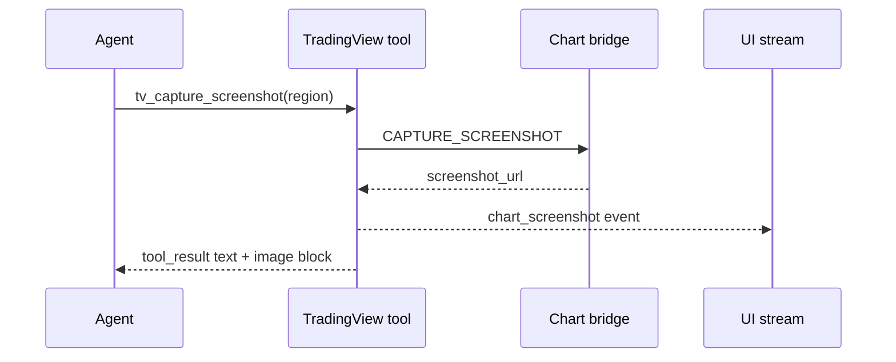

TradingView tools are the chart-control tools Rabit uses when a plain price lookup is not enough.

They are separate from the generic market family because they interact with a live chart surface, not only with backend market state.

## How the chart-analysis node uses this family

Rabit now uses one composable `chart_analysis` node with two bounded modes:

| Mode | When it is used | Purpose |
| --- | --- | --- |
| `analysis` | chart-heavy reads, indicator checks, technical inspection | inspect the workspace and gather technical evidence |
| `write` | explicit chart-mutation requests such as clear, mark, plot, or annotate | apply controlled drawings inside the current market-specialist path |

This is intentionally still one node.

Rabit does not hardcode a second chart runtime. Instead, the planner switches the node into `analysis` or `write` mode and injects a mode-specific instruction into the turn-level system prompt. That keeps the chart workflow composable while still letting the backend enforce different guardrails for reading versus writing.

### Analysis mode

| Allowed in `chart_analysis` analysis mode | Blocked from the LLM-facing schema |
| --- | --- |
| `tv_get_state` | drawing tools |
| `tv_set_symbol` when market scope is global | alert tools |
| `tv_set_timeframe` | chart-mutation tools |
| `tv_get_quote` | |
| `tv_get_indicator_values` | |
| `tv_add_indicator` | |
| `tv_remove_indicator` when cleanup is needed later | |
| `tv_capture_screenshot` if the chart workflow needs visual evidence | |

In this mode, the node behaves like a technical inspection step. It can align symbol or timeframe, add indicators temporarily, read values, and return trusted observations to the final answer.

### Write mode

| Allowed in `chart_analysis` write mode | Intentionally blocked |
| --- | --- |
| `tv_get_state` | alert tools |
| `tv_set_symbol` when market scope is global | indicator-management tools |
| `tv_set_timeframe` | unrestricted chart mutation |
| `tv_clear_drawings` on explicit user intent | free-form drawing access from the final model |
| `tv_draw_horizontal_line` | |
| `tv_draw_line` when the request includes enough coordinates | |
| `tv_capture_screenshot` after successful chart changes | |

In write mode, the node itself performs the chart mutation work. The final model does not get direct drawing tools at all. It only sees safe UI tools plus the node's trusted observation payload, which means the backend remains the real owner of chart mutations.

## How write mode is gated

| Rule | Why it exists |
| --- | --- |
| low-confidence routing does not enter write mode | prevents chart mutation on ambiguous requests |
| clarification-required routing does not enter write mode | prevents writes before the request is understood |
| `locked_asset` scope blocks symbol switching | prevents cross-asset mutation from a locked screen |
| drawing requires concrete prices or line coordinates | prevents vague chart-mutation behavior |
| screenshot capture runs after successful write actions | gives the UI and final answer visual confirmation |

## Full coverage of the TradingView family

| Category | Tools | What they do |
| --- | --- | --- |
| Chart control | `tv_get_state`, `tv_set_symbol`, `tv_set_timeframe`, `tv_set_chart_type`, `tv_scroll_to_date` | inspect and move the chart itself |
| Data reading | `tv_get_quote`, `tv_get_ohlcv`, `tv_get_indicator_values` | read quote, bars, and current indicator output |
| Indicators | `tv_add_indicator`, `tv_remove_indicator`, `tv_set_indicator_inputs` | manage technical indicators |
| Drawing | `tv_draw_line`, `tv_draw_horizontal_line`, `tv_clear_drawings` | annotate levels and chart structure |
| Alerts | `tv_create_alert`, `tv_list_alerts`, `tv_delete_alert` | manage chart alerts |
| Screenshot | `tv_capture_screenshot` | capture chart image for UI or analysis |

## How value is produced

## Why this family exists separately

| Market tools are good for... | TradingView tools are needed for... |
| --- | --- |
| prices, news, monitoring, lightweight context | chart state, visual indicators, annotations, screenshots, and chart-linked alerts |

This split matters because a chart workflow has different failure modes and different user expectations from a generic market lookup.

## Error handling inside this family

The TradingView client normalizes infrastructure errors before the agent sees them.

| Error source | How it is handled |
| --- | --- |
| API server not found | returns a structured connection error with a suggestion to start the chart API |
| timeout | returns a structured timeout error instead of hanging the turn |
| server-side 500 | returns a normalized server error payload |
| invalid response type | returns a structured format error |
| invalid input at tool layer | chart, alert, and indicator tools validate input locally before calling the bridge |

## How screenshot delivery works

`tv_capture_screenshot` now feeds two paths at once:

| Destination | What gets sent | Why it matters |
| --- | --- | --- |
| Agent runtime | screenshot metadata plus an inline image block when the chart bridge returns a reachable image URL | the model can analyze the actual chart image instead of only reading a text URL |
| Streaming system/UI | a `chart_screenshot` event with `region`, `screenshot_url`, and availability metadata | the frontend can render or persist the screenshot while the agent continues the turn |
| Pipeline artifact store | persisted chart-write screenshot record when the turn has a stable `scope_id` | the screenshot can be referenced again later instead of living only inside one turn |

The chart and alert tools then add their own friendly validation layer:

| Example | Tool behavior |
| --- | --- |
| invalid timeframe | `tv_set_timeframe` returns valid options and a formatting hint |
| invalid chart type | `tv_set_chart_type` returns accepted values |
| invalid date | `tv_scroll_to_date` returns the expected ISO format |
| bad alert condition | `tv_create_alert` returns valid conditions |
| missing alert id | `tv_delete_alert` suggests calling `tv_list_alerts` first |

## What the agent does when TradingView tools fail

| Failure type | Typical response pattern |
| --- | --- |
| local chart bridge unavailable | explain that chart control is offline and continue with backend market tools when possible |
| invalid chart command | ask for a corrected symbol, timeframe, alert condition, or drawing input |
| missing entity or alert id | inspect state first using `tv_get_state` or `tv_list_alerts` |

## Why this family matters in the product

TradingView tools give Rabit a visual technical-analysis layer.

That enables workflows like:

- "show me SOL on 4H and add RSI"
- "mark the invalidation level"
- "clear the old drawings and re-mark support and resistance"
- "what do the indicators currently say"
- "capture the current chart state"

## Related docs

| If you want... | Read |
| --- | --- |
| local chart bridge setup | [TradingView Setup](./setup) |
| chart runtime behavior | [TradingView State Management](./state-management) |
| the broader market tool layer | [Market Tools](../market) |
| source-specific background notes | [Backpack TradingView Notes](../../websocket/backpack/tradingview) |
