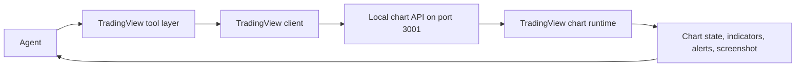

TradingView tools are the chart-control tools Rabit uses when a plain price lookup is not enough.

They are separate from the generic market family because they interact with a live chart surface, not only with backend market state.

## Full coverage of the TradingView family

| Category | Tools | What they do |
| --- | --- | --- |
| Chart control | `tv_get_state`, `tv_set_symbol`, `tv_set_timeframe`, `tv_set_chart_type`, `tv_scroll_to_date` | inspect and move the chart itself |
| Data reading | `tv_get_quote`, `tv_get_ohlcv`, `tv_get_indicator_values` | read quote, bars, and current indicator output |
| Indicators | `tv_add_indicator`, `tv_remove_indicator`, `tv_set_indicator_inputs` | manage technical indicators |
| Drawing | `tv_draw_line`, `tv_draw_horizontal_line`, `tv_clear_drawings` | annotate levels and chart structure |
| Alerts | `tv_create_alert`, `tv_list_alerts`, `tv_delete_alert` | manage chart alerts |
| Screenshot | `tv_capture_screenshot` | capture chart image for UI or analysis |

## How value is produced

## Why this family exists separately

| Market tools are good for... | TradingView tools are needed for... |
| --- | --- |
| prices, news, monitoring, lightweight context | chart state, visual indicators, annotations, screenshots, and chart-linked alerts |

This split matters because a chart workflow has different failure modes and different user expectations from a generic market lookup.

## Error handling inside this family

The TradingView client normalizes infrastructure errors before the agent sees them.

| Error source | How it is handled |
| --- | --- |
| API server not found | returns a structured connection error with a suggestion to start the chart API |
| timeout | returns a structured timeout error instead of hanging the turn |
| server-side 500 | returns a normalized server error payload |
| invalid response type | returns a structured format error |
| invalid input at tool layer | chart, alert, and indicator tools validate input locally before calling the bridge |

The chart and alert tools then add their own friendly validation layer:

| Example | Tool behavior |
| --- | --- |
| invalid timeframe | `tv_set_timeframe` returns valid options and a formatting hint |
| invalid chart type | `tv_set_chart_type` returns accepted values |
| invalid date | `tv_scroll_to_date` returns the expected ISO format |
| bad alert condition | `tv_create_alert` returns valid conditions |
| missing alert id | `tv_delete_alert` suggests calling `tv_list_alerts` first |

## What the agent does when TradingView tools fail

| Failure type | Typical response pattern |
| --- | --- |
| local chart bridge unavailable | explain that chart control is offline and continue with backend market tools when possible |
| invalid chart command | ask for a corrected symbol, timeframe, alert condition, or drawing input |
| missing entity or alert id | inspect state first using `tv_get_state` or `tv_list_alerts` |

## Why this family matters in the product

TradingView tools give Rabit a visual technical-analysis layer.

That enables workflows like:

- “show me SOL on 4H and add RSI”
- “mark the invalidation level”
- “what do the indicators currently say”
- “capture the current chart state”

## Related docs

| If you want... | Read |
| --- | --- |
| local chart bridge setup | [TradingView Setup](./setup) |
| chart runtime behavior | [TradingView State Management](./state-management) |
| the broader market tool layer | [Market Tools](../market) |
| source-specific background notes | [Backpack TradingView Notes](../../websocket/backpack/tradingview) |
