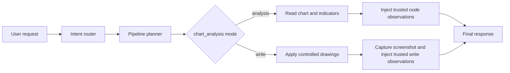
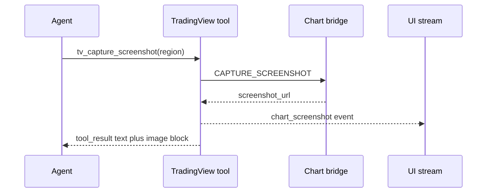

TradingView tools are the chart-control tools Rabit uses when a plain price lookup is not enough.

They are separate from the generic market family because they interact with a live chart surface, not only with backend market state.

## What this family is for

| Product need | How TradingView tools help |
| --- | --- |
| inspect the current workspace | chart-state tools read symbol, timeframe, indicators, and chart mode |
| read technical evidence | indicator and quote tools pull current chart-linked values |
| mutate the chart safely | drawing and chart-control tools apply bounded changes through the backend |
| capture visual proof | screenshot tools turn the current chart state into an artifact the UI and agent can reuse |

## How the chart-analysis node uses this family

Rabit uses one composable `chart_analysis` node with two bounded modes:

| Mode | When it is used | Purpose |
| --- | --- | --- |
| `analysis` | chart-heavy reads, indicator checks, technical inspection | inspect the workspace and gather technical evidence |
| `write` | explicit chart-mutation requests such as clear, mark, plot, or annotate | apply controlled drawings inside the current market-specialist path |

This is intentionally still one node. The planner switches the node into `analysis` or `write` mode and injects a mode-specific instruction into the turn-level system prompt.

## Analysis and write boundaries

| Mode | Allowed | Blocked |
| --- | --- | --- |
| `analysis` | `tv_get_state`, `tv_set_symbol` when scope is global, `tv_set_timeframe`, `tv_get_quote`, `tv_get_indicator_values`, `tv_add_indicator`, optional `tv_remove_indicator`, optional `tv_capture_screenshot` | drawing tools, alert tools, unrestricted chart mutation |
| `write` | `tv_get_state`, `tv_set_symbol` when scope is global, `tv_set_timeframe`, `tv_clear_drawings` on explicit intent, `tv_draw_horizontal_line`, `tv_draw_line`, `tv_capture_screenshot` | alert tools, indicator-management tools, direct drawing access from the final model |

## How this family works

## All TradingView tools

| Tool | Useful for | Main value source | Failure shape |
| --- | --- | --- | --- |
| `tv_get_state` | inspect current chart state | TradingView bridge API | connectivity or bridge read failure |
| `tv_set_symbol` | switch chart symbol | TradingView bridge API | invalid symbol or bridge failure |
| `tv_set_timeframe` | switch timeframe | TradingView bridge API | invalid timeframe or bridge failure |
| `tv_set_chart_type` | switch chart style | TradingView bridge API | invalid chart type or bridge failure |
| `tv_scroll_to_date` | jump to historical region | TradingView bridge API | invalid date or bridge failure |
| `tv_get_quote` | inspect chart-linked quote | TradingView bridge API | read failure |
| `tv_get_ohlcv` | inspect bars or summary stats | TradingView bridge API | read failure |
| `tv_get_indicator_values` | inspect visible indicator output | TradingView bridge API | read failure |
| `tv_add_indicator` | add technical indicator | TradingView bridge API | invalid input or bridge failure |
| `tv_remove_indicator` | remove one indicator | TradingView bridge API | not-found or bridge failure |
| `tv_set_indicator_inputs` | change indicator settings | TradingView bridge API | invalid input or bridge failure |
| `tv_draw_line` | draw one line | TradingView bridge API | validation or bridge failure |
| `tv_draw_horizontal_line` | draw one horizontal level | TradingView bridge API | validation or bridge failure |
| `tv_clear_drawings` | clear chart drawings | TradingView bridge API | bridge failure |
| `tv_create_alert` | create chart alert | TradingView bridge API | validation or bridge failure |
| `tv_list_alerts` | inspect chart alerts | TradingView bridge API | bridge failure |
| `tv_delete_alert` | delete chart alert | TradingView bridge API | not-found or bridge failure |
| `tv_capture_screenshot` | capture chart image | TradingView bridge API | bridge failure |

## Per-tool breakdown

| Tool | Useful for | How it works | Main output |
| --- | --- | --- | --- |
| `tv_get_state` | inspect current workspace state | reads symbol, timeframe, chart type, and related chart state through the bridge | chart-state snapshot |
| `tv_set_symbol` | switch the chart to another asset | sends a symbol-change command to the chart bridge | updated chart state |
| `tv_set_timeframe` | switch the chart timeframe | sends a timeframe-change command to the chart bridge | updated chart state |
| `tv_set_chart_type` | switch the chart visualization style | sends a chart-type command to the bridge | updated chart state |
| `tv_scroll_to_date` | move to a historical region | sends a date-scroll command to the bridge | updated chart viewport |
| `tv_get_quote` | inspect quote-level chart data | reads chart-linked quote information through the bridge | quote snapshot |
| `tv_get_ohlcv` | inspect bars or summary stats | reads OHLCV-oriented data through the bridge | OHLCV or summary data |
| `tv_get_indicator_values` | inspect technical values | reads visible indicator output from the chart | indicator-value snapshot |
| `tv_add_indicator` | add an indicator | sends an add-indicator command through the bridge | indicator add result |
| `tv_remove_indicator` | remove an indicator | sends a remove command for one indicator entity | indicator removal result |
| `tv_set_indicator_inputs` | tune indicator settings | sends updated indicator inputs through the bridge | indicator update result |
| `tv_draw_line` | draw one line | sends explicit coordinates or levels to the drawing bridge | drawing result |
| `tv_draw_horizontal_line` | mark one horizontal level | sends a horizontal-level draw request to the bridge | drawing result |
| `tv_clear_drawings` | clear existing annotations | sends a clear-drawings command to the bridge | clear result |
| `tv_create_alert` | add chart-native alert | sends an alert definition to the bridge | alert creation result |
| `tv_list_alerts` | inspect chart-native alerts | reads alert state back from the bridge | alert list |
| `tv_delete_alert` | delete one chart-native alert | sends a delete request for one alert id | delete result |
| `tv_capture_screenshot` | capture visual proof | requests a chart screenshot, then forwards metadata to the agent, UI stream, and artifact flow | screenshot metadata and optional image block |

## How screenshot delivery works

`tv_capture_screenshot` now feeds multiple paths at once:

| Destination | What gets sent | Why it matters |
| --- | --- | --- |
| Agent runtime | screenshot metadata plus an inline image block when the bridge returns a reachable image URL | the model can analyze the actual chart image instead of only a text URL |
| Streaming system or UI | a `chart_screenshot` event with region, screenshot URL, and availability metadata | the frontend can render or persist the screenshot while the agent continues the turn |
| Pipeline artifact store | persisted chart-write screenshot record when the turn has a stable `scope_id` | the screenshot can be referenced again later instead of living only inside one turn |

## Error handling inside this family

| Error source | How it is handled |
| --- | --- |
| API server not found | returns a structured connection error with a suggestion to start the chart API |
| timeout | returns a structured timeout error instead of hanging the turn |
| server-side 500 | returns a normalized server error payload |
| invalid response type | returns a structured format error |
| invalid input at tool layer | chart, alert, and indicator tools validate input locally before calling the bridge |

## What the agent does when TradingView tools fail

| Failure type | Typical response pattern |
| --- | --- |
| local chart bridge unavailable | explain that chart control is offline and continue with backend market tools when possible |
| invalid chart command | ask for a corrected symbol, timeframe, alert condition, or drawing input |
| missing entity or alert id | inspect state first using `tv_get_state` or `tv_list_alerts` |

## Why this family matters in the product

TradingView tools give Rabit a visual technical-analysis layer.

That enables workflows like:

- "show me SOL on 4H and add RSI"
- "mark the invalidation level"
- "clear the old drawings and re-mark support and resistance"
- "what do the indicators currently say"
- "capture the current chart state"

## Related docs

| If you want... | Read |
| --- | --- |
| local chart bridge setup | [TradingView Setup](./setup) |
| chart runtime behavior | [TradingView State Management](./state-management) |
| the broader market tool layer | [Market Tools](../market) |
| source-specific background notes | [Backpack TradingView Notes](../../websocket/backpack/tradingview) |
