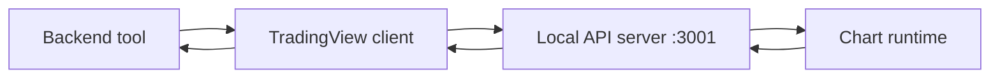

TradingView tools depend on a local chart bridge, not only on the Python backend.

That means setup matters more here than in most other tool families.

## Required pieces

| Component | Role |
| --- | --- |
| TradingView chart runtime | renders and maintains the chart state |
| local chart API | accepts backend commands on the expected local port |
| backend TradingView client | sends normalized commands and reads normalized responses |

## Expected flow

## What setup failures look like

| Failure type | How the client reports it |
| --- | --- |
| API server not running | explicit connection error with a suggestion to start the server |
| endpoint missing | explicit 404 error with bridge startup guidance |
| timeout | explicit timeout error with retry guidance |
| invalid JSON response | explicit format error pointing to broken server behavior |

## Why this page exists

Most Rabit tools are backend-native. TradingView is different because it crosses a bridge into the chart runtime.

That is why a clean setup explanation is important: many TradingView failures are infrastructure issues, not market logic issues.

## Related docs

| If you want... | Read |
| --- | --- |
| how chart state behaves after setup | [TradingView State Management](./state-management) |
| the family overview | [TradingView Tools](./index) |
| source-specific notes | [Backpack TradingView Notes](../../websocket/backpack/tradingview) |
