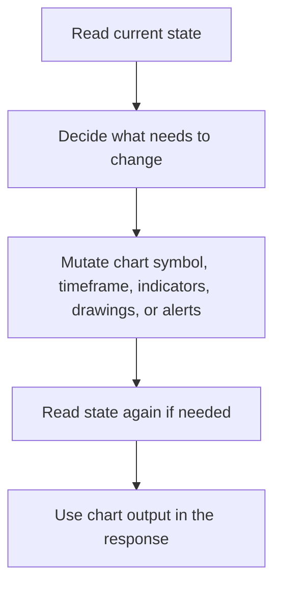

TradingView tools are stateful.

Unlike a one-shot market lookup, chart operations depend on what is already on the chart:

- current symbol
- timeframe
- chart type
- indicators already attached
- drawings and alerts already created

## Why state matters

| Operation | Why state is important |
| --- | --- |
| `tv_get_state` | establishes what the chart already contains |
| `tv_remove_indicator` | requires an existing indicator entity ID |
| `tv_set_indicator_inputs` | requires a target indicator already present |
| `tv_delete_alert` | requires an existing alert ID |

## Typical stateful workflow

## Error handling in stateful workflows

| Failure type | Tool behavior | Agent implication |
| --- | --- | --- |
| missing entity ID | returns a normalized not-found style error | inspect state first before mutating |
| invalid mutation input | local validation catches it early | ask for corrected timeframe, indicator input, or alert condition |
| chart bridge unavailable mid-flow | normalized bridge error | fall back to non-chart market tools rather than pretending the chart was changed |

## Practical rule for the agent

The safe pattern is:

1. inspect chart state
2. mutate only what is necessary
3. read back the result when the chart state matters to the answer

That keeps TradingView workflows predictable and easier for the frontend user to understand.

## Related docs

| If you want... | Read |
| --- | --- |
| setup expectations | [TradingView Setup](./setup) |
| family overview | [TradingView Tools](./index) |
| related runtime notes | [Backpack TradingView Quickstart](../../websocket/backpack/tradingview-quickstart) |
