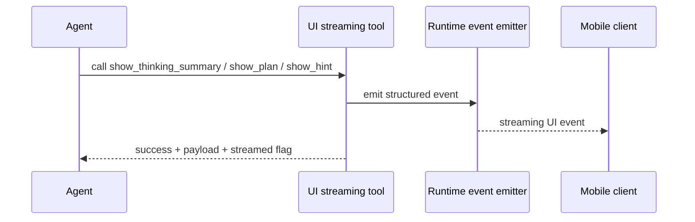

UI streaming tools are the bridge between the agent runtime and the frontend experience.

They do not fetch prices, read exchange state, or save memory. Their job is different: they make the streaming experience structured enough for the mobile client to render well.

They also matter at the pipeline-planning layer:

- `general_fallback` is intentionally narrowed to safe UI-only tools
- `clarification_prep` is intentionally narrowed to `show_hint` only

## What this family is for

| Product need | How UI streaming tools help |
| --- | --- |
| show visible progress during a long turn | `show_thinking_summary` emits concise progress updates |
| present a structured execution plan | `show_plan` streams steps that the client can render cleanly |
| ask for human-in-the-loop branching | `show_hint` emits explicit option sets instead of vague prose |

## All UI streaming tools

| Tool | Useful for | Value source | Failure shape |
| --- | --- | --- | --- |
| `show_thinking_summary` | concise progress update | runtime event emitter | empty summary raises; missing emitter returns `streamed: false` |
| `show_plan` | structured plan with status and steps | runtime event emitter | invalid status or malformed `steps_json` |
| `show_hint` | human-in-the-loop branch prompt | runtime event emitter | invalid title or malformed `options_json` |

## How this family works

## Per-tool breakdown

| Tool | Useful for | How it works | Main output |
| --- | --- | --- | --- |
| `show_thinking_summary` | surface concise progress text | validates the summary, emits it through the runtime event emitter, and returns whether it was streamed | thinking-summary payload |
| `show_plan` | surface a structured multi-step plan | validates plan status and steps JSON, emits the plan, and returns whether it was streamed | plan payload |
| `show_hint` | ask the user to choose a branch | validates title and options JSON, emits a HITL hint, and returns whether it was streamed | hint payload |

## Why this family matters

| Without UI tools | With UI tools |
| --- | --- |
| the user only sees a text stream | the client can show progress, plans, and branch choices clearly |
| intermediate reasoning is hard to present safely | summaries and hints are already shaped for the product UI |
| human-in-the-loop points are ambiguous | `show_hint` creates explicit branch choices |

## Error handling and agent behavior

| Failure type | How it is handled | What the agent should do |
| --- | --- | --- |
| invalid summary, plan, or hint payload | the tool raises validation errors immediately | fix the payload instead of pretending the UI event was sent |
| no event emitter in current runtime | tool returns `streamed: false` while still returning the payload | continue the response, knowing the event did not reach a live streaming consumer |

## Why this is important in Rabit

These tools are one of the reasons Rabit feels like an app rather than a terminal transcript.

They make it possible for the frontend to render:

- progress summaries
- step-by-step plans
- guided user choices

without trying to reverse-engineer them from free-form text.

## Related docs

| If you want... | Read |
| --- | --- |
| the agent streaming API contract | [API Reference: Agent](/api-reference/agent) |
| broader runtime behavior | [Agent Platform](../features/agent) |
