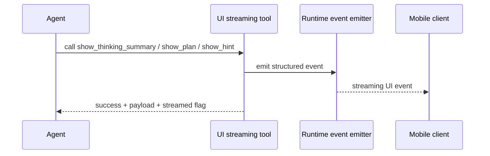

UI streaming tools are the bridge between the agent runtime and the frontend experience.

They do not fetch prices, read exchange state, or save memory. Their job is different: they make the streaming experience structured enough for the mobile client to render well.

## Full coverage

| Tool | What it emits | Value source | Failure model |
| --- | --- | --- | --- |
| `show_thinking_summary` | concise progress update | runtime event emitter | raises when summary is empty; otherwise returns `streamed: false` if no emitter exists |
| `show_plan` | structured plan with status and steps | runtime event emitter | raises on invalid status or malformed `steps_json` |
| `show_hint` | human-in-the-loop branch prompt | runtime event emitter | raises on invalid title or malformed `options_json` |

## How the UI event path works

## Why this family matters

| Without UI tools | With UI tools |
| --- | --- |
| the user only sees a text stream | the client can show progress, plans, and branch choices clearly |
| intermediate reasoning is hard to present safely | summaries and hints are already shaped for the product UI |
| human-in-the-loop points are ambiguous | `show_hint` creates explicit branch choices |

## Error handling and agent behavior

| Failure type | How it is handled | What the agent should do |
| --- | --- | --- |
| invalid summary/plan/hint payload | the tool raises validation errors immediately | fix the payload instead of pretending the UI event was sent |
| no event emitter in current runtime | tool returns `streamed: false` while still returning the payload | continue the response, knowing the event did not reach a live streaming consumer |

## Why this is important in Rabit

These tools are one of the reasons Rabit feels like an app rather than a terminal transcript.

They make it possible for the frontend to render:

- progress summaries
- step-by-step plans
- guided user choices

without trying to reverse-engineer them from free-form text.

## Related docs

| If you want... | Read |
| --- | --- |
| the agent streaming API contract | [API Reference: Agent](/api-reference/agent) |
| broader runtime behavior | [Agent Platform](../features/agent) |
