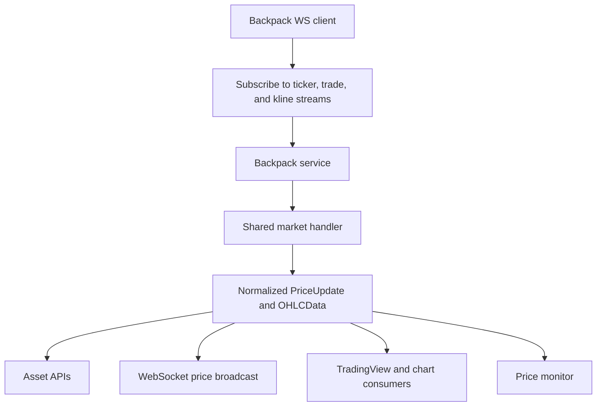

Backpack is one of Rabit’s main live market-data sources.

On the WebSocket side, Backpack is used for current market awareness rather than account ownership or execution storage.

## What Backpack contributes

| Contribution | What it gives Rabit |
| --- | --- |
| real-time price updates | current market movement for tracked assets |
| ticker updates | 24-hour statistics such as last price, change, volume, high, and low |
| trade updates | more frequent price movement than ticker-only flows |
| OHLC stream data | candle-oriented updates for charting workflows |

## How the Backpack data path works

## How a Backpack price reaches the product

The Backpack client listens to multiple stream types:

| Stream type | Why it is useful |
| --- | --- |
| ticker | gives 24-hour market statistics and last-price style updates |
| trade | gives more frequent trade-based price movement |
| kline | gives OHLC updates for chart and candle workflows |

Those raw messages are parsed and then converted into shared backend structures so the rest of the product does not need to understand Backpack’s native payload format.

## Error and recovery behavior

From the current code path, Backpack handling includes:

| Failure type | Current behavior |
| --- | --- |
| connection failure | logged by the client and surfaced through the service start path |
| subscription failure for one symbol | logged while the service keeps processing other subscriptions |
| invalid JSON or malformed payload | logged without taking down the whole process |
| callback failure | caught and logged so one consumer does not break all listeners |

## What this page is not about

This page is about Backpack as a market-data source.

It is not the page for:

- encrypted Backpack credential storage
- Backpack account ownership
- Backpack execution tools

Use the integration docs for those topics.

## Read this with

- [Backpack Integration](/integrations/backpack)
- [Backpack Integration Notes](./integration)
- [TradingView Quickstart](./tradingview-quickstart)
- [TradingView Notes](./tradingview)

