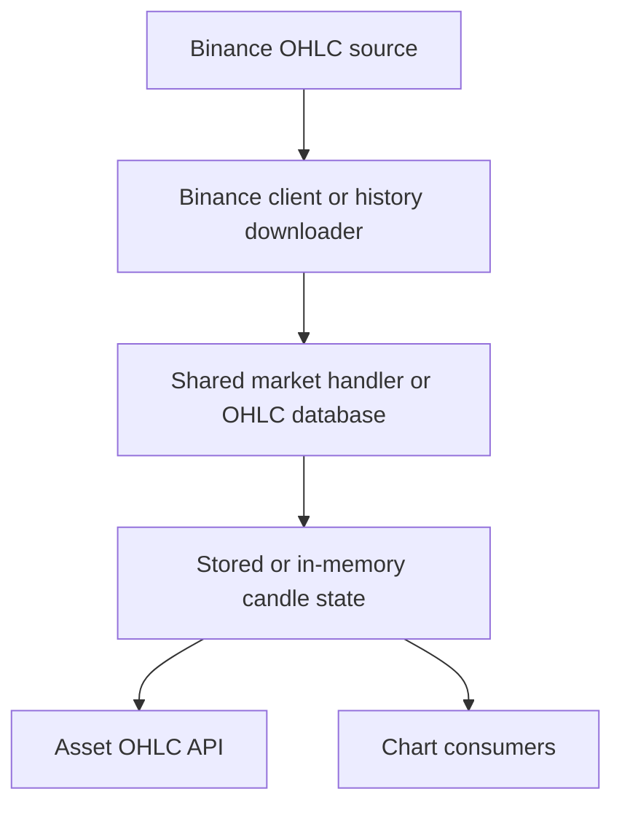

Binance is mainly used in Rabit as a historical and chart-oriented market-data source.

Its role is different from Backpack and Drift. It is less about live exchange identity and more about reliable OHLC access.

## What Binance contributes

| Contribution | What it gives Rabit |
| --- | --- |
| historical OHLC downloads | candle history when chart workflows need it |
| chart-oriented candle retrieval | supports frontend charts and technical analysis |
| fallback market history | helps when a workflow needs more candle depth than in-memory stream state |

## How the Binance data path works

## How Rabit gets OHLC from Binance

The Binance side of the system supports two main paths:

| Path | What it is for |
| --- | --- |
| WebSocket client | live candle-oriented updates when subscribed |
| history downloader | explicit historical OHLC fetches and persistence |

That makes Binance especially useful for chart views that need candle depth rather than only the latest trade price.

## Error and recovery behavior

From the current code path, Binance handling includes:

| Failure type | Current behavior |
| --- | --- |
| WebSocket connection failure | logged by the client |
| invalid JSON or payload parse failure | logged during message handling |
| OHLC download failure | logged by the history downloader |
| callback failure | caught so one downstream consumer does not break the source path |

## What this page is not about

Binance is not currently documented here as an account or execution surface for Rabit.

This page is about market data, chart support, and OHLC history.

## Read this with

- [WebSocket Overview](../overview)
- [Data Sources](../data-sources)
- [Real-Time Market Data](/features/market-data)
- [OHLC Database](/integrations/ohlc/database)

