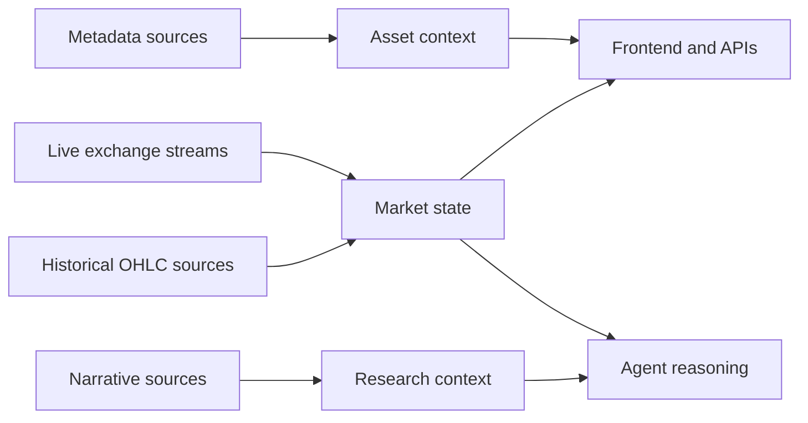

Rabit does not depend on only one kind of data source.

Different product features need different kinds of inputs, and each source is chosen for a different job.

## Source categories

| Source category | Current sources | What they provide |
| --- | --- | --- |
| live exchange streams | Backpack, Drift | real-time prices, market events, and exchange-native timing awareness |
| historical/chart data | Binance OHLC workflows, exchange OHLC streams | candles and chart-oriented history |
| metadata and enrichment | CoinGecko | names, categories, descriptions, and asset metadata |
| narrative context | news sources, web search | explanation and context around current moves |

## Which source is used for what

| Product need | Primary source | Why |
| --- | --- | --- |
| latest price and live updates | Backpack or Drift | exchange-native, current market signal |
| OHLC and candles | Backpack/Drift streams or Binance historical workflows | charting and technical analysis support |
| asset detail and categories | CoinGecko | metadata, categories, and enrichment |
| narrative explanation | news and search | market context beyond raw price action |

## How the source mix helps Rabit

This mix matters because the backend is not trying to answer only one question.

It needs to support:

- what is happening now
- what has been happening on the chart
- what this asset is
- why the move might matter

That is why the data layer is intentionally mixed instead of pretending one source can do everything.

## How this connects to product behavior

## Read this with

- [WebSocket Overview](./overview)
- [Backpack WebSocket](./backpack)
- [Drift WebSocket](./drift)
- [Binance Market Data](./binance)
- [Real-Time Market Data](/features/market-data)

