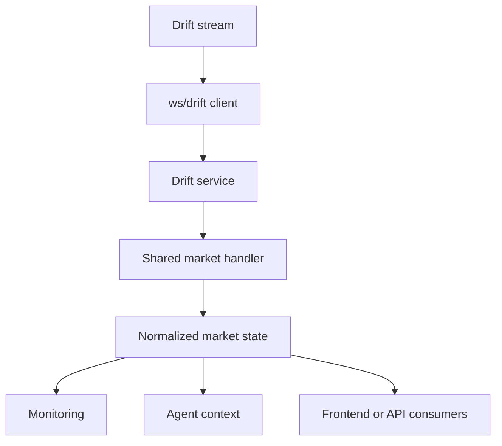

Drift is used in the WebSocket layer as a live market-data source for Solana-native market awareness.

This is separate from Drift’s account-read and execution-preparation behavior.

## What Drift contributes

| Contribution | What it gives Rabit |
| --- | --- |
| live market data | current exchange-native price context |
| perp-oriented awareness | useful for perp-heavy market workflows |
| OHLC-compatible updates | chart and candle support where available |
| analysis context | stronger market awareness for agent and monitoring flows |

## How the Drift data path works

## How Rabit uses Drift in this layer

This page is specifically about stream-oriented market data.

That means Drift is used here for:

| Use case | Why it fits |
| --- | --- |
| public market data | gives live signal without requiring private account reads |
| price awareness | keeps the system current on relevant market movement |
| market context enrichment | helps analysis and monitoring feel timely |

## Error and recovery behavior

From the current service/client path, Drift handling includes:

| Failure type | Current behavior |
| --- | --- |
| service start failure | logged during initialization |
| subscription failure for one symbol | logged while the remaining subscriptions continue |
| callback failure | caught so one consumer does not break the stream path |
| stop lifecycle failure | logged during shutdown handling |

## What this page is not about

This page is not the place for:

- Drift account read-only tools
- wallet auth
- same-wallet execution preparation
- signer or session-key design

Those belong to the integration and execution docs.

## Read this with

- [Drift Integration](/integrations/drift)
- [Drift Auth and Execution Wallet](/integrations/drift/auth-and-execution-wallet)
- [Agent Exchange Behavior: Drift](/agents/exchanges/drift)

