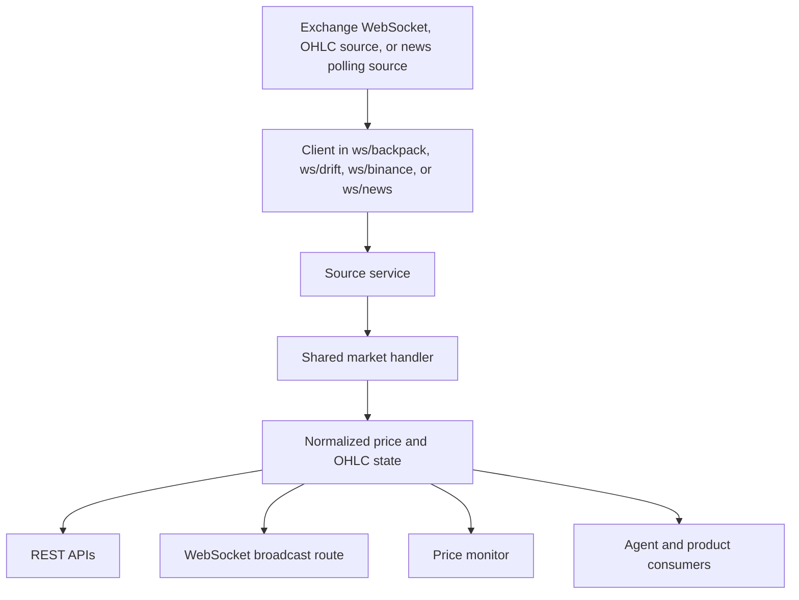

Rabit needs more than static REST responses. It needs a live market pulse.

This section explains how real-time market data enters the backend, how prices are normalized, and how the rest of the product consumes that state.

## Why this layer exists

If Rabit wants to help users react to changing conditions, it cannot rely only on one-off lookups.

It needs a live path for:

| Need | Why it matters |
| --- | --- |
| price movement | keeps market views current |
| OHLC updates | supports charting and technical workflows |
| news updates | keeps catalyst-aware surfaces current |
| monitoring | powers alert-style product behavior |
| frontend updates | supports live product surfaces |
| agent context | gives the assistant timing awareness |

## The live data pipeline

## How Rabit gets a price

At a high level, price data follows the same path regardless of source:

1. a source client receives a raw payload from Backpack, Drift, or Binance
2. the source service forwards that event into the shared market handler
3. the handler normalizes it into a common internal structure such as `PriceUpdate` or `OHLCData`
4. the normalized state becomes available to:
   - asset APIs
   - the `/api/ws/prices` broadcast path
   - monitoring and alert logic
   - agent-facing product features

## Shared responsibilities in this layer

| Responsibility | What it means in practice |
| --- | --- |
| source subscription | connect to exchange or data provider feeds |
| normalization | convert provider-specific payloads into shared internal models |
| state retention | keep the latest price or OHLC state available in memory and storage |
| distribution | expose the normalized data to APIs, broadcasts, and services |
| recovery | log failures, handle invalid messages, and keep the service lifecycle observable |

## Error and recovery model

This layer is designed around source-specific clients plus shared consumers.

From the code path, the current handling model includes:

| Failure type | Current behavior |
| --- | --- |
| connection failure | source client logs the failure and the service start path reports the error |
| invalid payload or JSON | the client logs the bad message instead of crashing the whole backend |
| callback failure | source clients catch callback errors so one consumer does not break all updates |
| subscription failure for one symbol | the service logs the error and continues processing other symbols |
| monitor loop failure | the monitor logs the error and retries after a delay |

This is not a full fault-tolerant event platform yet, but it is enough to support a practical real-time market layer with observable failure paths.

## Current sources

| Source | Main role in Rabit |
| --- | --- |
| Backpack | live price and OHLC-oriented market data |
| Drift | live perp-oriented market context and price awareness |
| Binance | historical and chart-oriented OHLC workflows |
| News monitor | live headline updates derived from the existing news retrieval layer |

## News freshness fields

For news, the backend now exposes more than one time marker because "published time" and "seen by Rabit" are not always the same.

| Field | Meaning | Typical frontend use |
| --- | --- | --- |
| `date` | publish time returned by the news source, when available | show the original article time |
| `detected_at` | when the Rabit backend first observed the article | decide whether a headline is newly discovered |
| `timestamp` | when the snapshot or WebSocket payload was emitted | align the client with the current backend update cycle |
| `freshness_seconds` | seconds since `detected_at` | sort or fade headlines by recency without recalculating in the client |
| `is_new` | backend helper flag for recently detected items | render a simple "new" badge in the UI |

This is important because an article can be published earlier, but only become visible to the product later. The frontend should treat `detected_at` as the best signal for "new to Rabit" and `date` as the best signal for "original article age".

The `is_new` window is configurable through `NEWS_IS_NEW_WINDOW_SECONDS`. The default is `86400` seconds, which means Rabit treats headlines detected within the last 24 hours as new.

## Read this with

- [Data Sources](./data-sources)
- [Backpack WebSocket](./backpack)
- [Drift WebSocket](./drift)
- [Binance Market Data](./binance)
